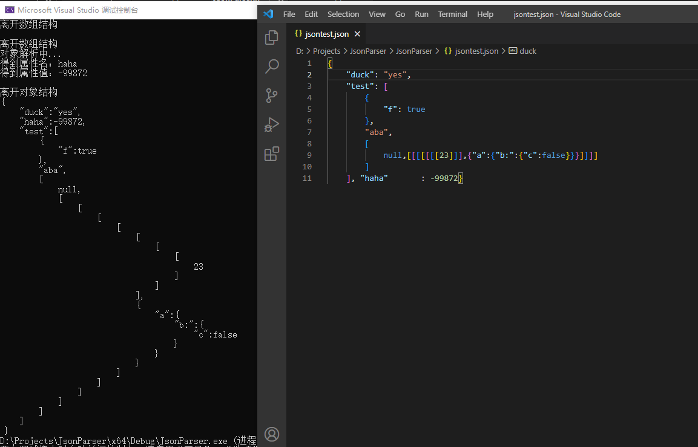

# JsonParser
题目：不参考其它库，用C++实现一个json parser，读取标准json数据并带缩进的输出

实现功能：从文件中读取json数据（假设可以一次性读入内存），以树形结构储存，最后通过深度优先输出

运行截图：（我保留了一部分DEBUG的痕迹...）

可进一步改善的：将数据包装成对象实现增删改查功能，大文件读写优化，优化统一debug日志输出流向，添加main函数参数并导出可执行文件。但是感觉目前已达到题目要求，考虑到时间成本，并没有深入。
